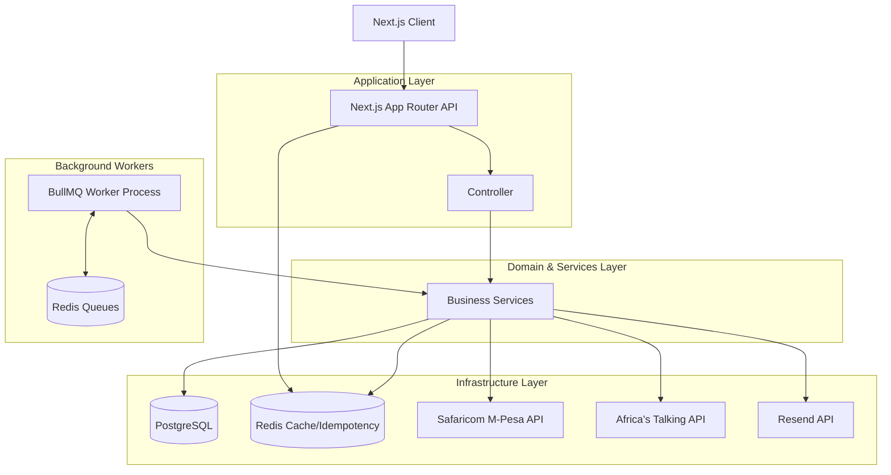

# System Architecture

The following diagram illustrates the hardened Phase 1 architecture of Sky Kenya.

## Key Components

1. **Next.js App Router**: Acts as both the presentation layer (React Server Components) and the API Gateway `/api/v1/*`.
2. **Business Services**: Abstraction layer containing the core domain logic (e.g. `WalletService`, `CampaignService`). Avoids direct dependency on external infrastructure details where possible.
3. **BullMQ Workers**: Dedicated Node process (`npm run worker`) that processes deferred tasks (payouts, cleanups) to ensure the web tier remains highly responsive and stateless.
4. **Redis**: Centralized cache for Idempotency keys (preventing double-spend) and the backing store for BullMQ background jobs.
5. **PostgreSQL**: Primary data store for users, campaigns, submissions, and the financial ledger.
